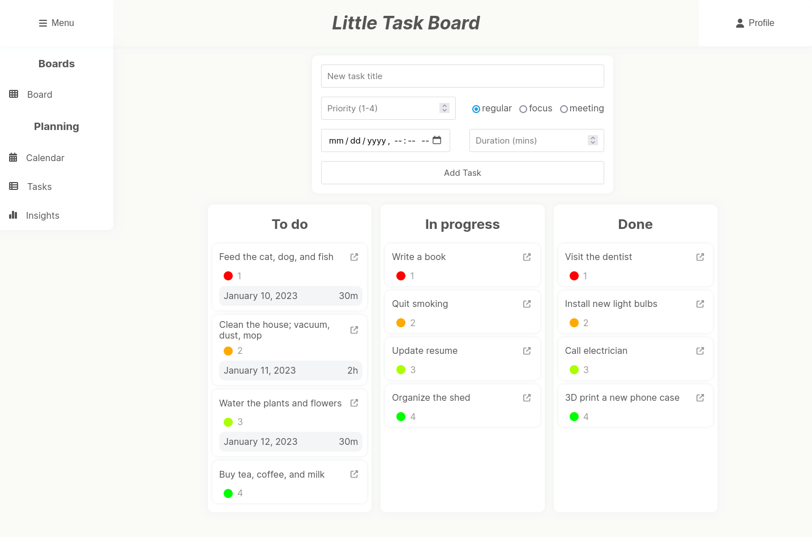

# Little Task Board

## Screenshots

**TODO: More description will be added soon**

Goal: Solve the surprisingly complex problem of managing work. This is intended to be a flexible tool that can scale from a simple personal todo list to a full ticket management system.

## Features

| Feature                             | Description                                                     | Status |
| :---------------------------------- | :-------------------------------------------------------------- | :----- |
| Track tasks                         | Create, edit, delete, and move tasks between columns            | ✅      |
| Calendar                            | View tasks on a calendar                                        | ✅      |
| Search, filter, sort                | Search and filter tasks by name, description, and tags          | ✅      |
| Insights                            | View insights about productivity (time spent in focus/meetings) | ✅      |
| Responsive                          | Works on mobile, tablet, and desktop                            | ✅      |
| Dark Mode                           | Toggle between light and dark mode                              | ✅      |
| Multiple boards                     | Create multiple boards                                          | ❌      |
| Share boards                        | Share boards with others                                        | ❌      |
| Notifications                       | Get notified when tasks are updated                             | ❌      |
| Comments                            | Add comments to tasks                                           | ❌      |
| Attachments                         | Attach files to tasks                                           | ❌      |
| Email integration                   | Create tasks by sending an email                                | ❌      |
| Slack integration                   | Create tasks by sending a Slack message                         | ❌      |
| GitHub/GitLab/BitBucket integration | Create tasks by creating an issue                               | ❌      |
| Recurring tasks                     | Create tasks that repeat on a schedule                          | ❌      |
| Task dependencies                   | Define dependencies (even chains) between tasks                 | ❌      |
| Calendar sync                       | Sync tasks with Google Calendar                                 | ❌      |

# Tech Stack

As this started a personal project to learn new technologies, the tech stack is a bit of a hodgepodge.

## Frontend

- [React](https://reactjs.org/)
- [React Router](https://reactrouter.com/)
- [Tailwind CSS](https://tailwindcss.com/)
- [shadcn ui](https://ui.shadcn.com/)
- [React Toastify](https://fkhadra.github.io/react-toastify/introduction)
- [React Beautiful DND](https://github.com/atlassian/react-beautiful-dnd/)
- [TypeScript](https://www.typescriptlang.org/)

## Backend

- [Flask](https://flask.palletsprojects.com/en/2.0.x/)
- [SQLite](https://www.sqlite.org/index.html)
- [pytest](https://docs.pytest.org/en/6.2.x/)

## Learnings

- Setting up & serving arbitrary frontends & backends, CORS
- Middleware, JWT authentication, routing, structuring a REST API
- Thinking in React, state management, structuring DOM, avoiding re-renders, async...await
- Data visualization, charting, calendar, drag & drop
- Setting up databases, ORM, migrations, testing, CI/CD
- Semantic HTML, CSS, BEM notation (eventually migrated to Tailwind to accommodate shadcn ui)

# Getting Started with Create React App

This project was bootstrapped with [Create React App](https://github.com/facebook/create-react-app).

## Available Scripts

In the project directory, you can run:

### `npm start`

Runs the app in the development mode.\
Open [http://localhost:3000](http://localhost:3000) to view it in your browser.

The page will reload when you make changes.\
You may also see any lint errors in the console.

### `npm test`

Launches the test runner in the interactive watch mode.\
See the section about [running tests](https://facebook.github.io/create-react-app/docs/running-tests) for more information.

### `npm run build`

Builds the app for production to the `build` folder.\
It correctly bundles React in production mode and optimizes the build for the best performance.

The build is minified and the filenames include the hashes.\
Your app is ready to be deployed!

See the section about [deployment](https://facebook.github.io/create-react-app/docs/deployment) for more information.

### `npm run eject`

**Note: this is a one-way operation. Once you `eject`, you can't go back!**

If you aren't satisfied with the build tool and configuration choices, you can `eject` at any time. This command will remove the single build dependency from your project.

Instead, it will copy all the configuration files and the transitive dependencies (webpack, Babel, ESLint, etc) right into your project so you have full control over them. All of the commands except `eject` will still work, but they will point to the copied scripts so you can tweak them. At this point you're on your own.

You don't have to ever use `eject`. The curated feature set is suitable for small and middle deployments, and you shouldn't feel obligated to use this feature. However we understand that this tool wouldn't be useful if you couldn't customize it when you are ready for it.

## Learn More

You can learn more in the [Create React App documentation](https://facebook.github.io/create-react-app/docs/getting-started).

To learn React, check out the [React documentation](https://reactjs.org/).

### Code Splitting

This section has moved here: [https://facebook.github.io/create-react-app/docs/code-splitting](https://facebook.github.io/create-react-app/docs/code-splitting)

### Analyzing the Bundle Size

This section has moved here: [https://facebook.github.io/create-react-app/docs/analyzing-the-bundle-size](https://facebook.github.io/create-react-app/docs/analyzing-the-bundle-size)

### Making a Progressive Web App

This section has moved here: [https://facebook.github.io/create-react-app/docs/making-a-progressive-web-app](https://facebook.github.io/create-react-app/docs/making-a-progressive-web-app)

### Advanced Configuration

This section has moved here: [https://facebook.github.io/create-react-app/docs/advanced-configuration](https://facebook.github.io/create-react-app/docs/advanced-configuration)

### Deployment

This section has moved here: [https://facebook.github.io/create-react-app/docs/deployment](https://facebook.github.io/create-react-app/docs/deployment)

### `npm run build` fails to minify

This section has moved here: [https://facebook.github.io/create-react-app/docs/troubleshooting#npm-run-build-fails-to-minify](https://facebook.github.io/create-react-app/docs/troubleshooting#npm-run-build-fails-to-minify)
